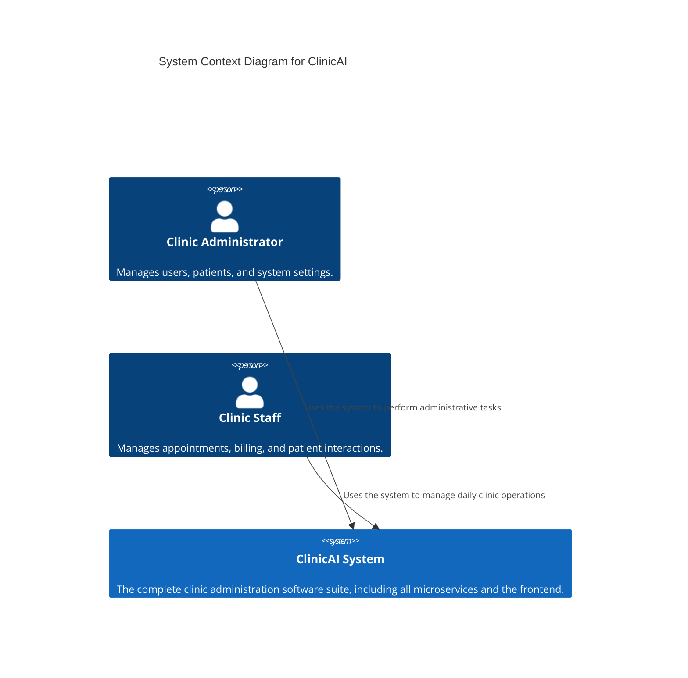
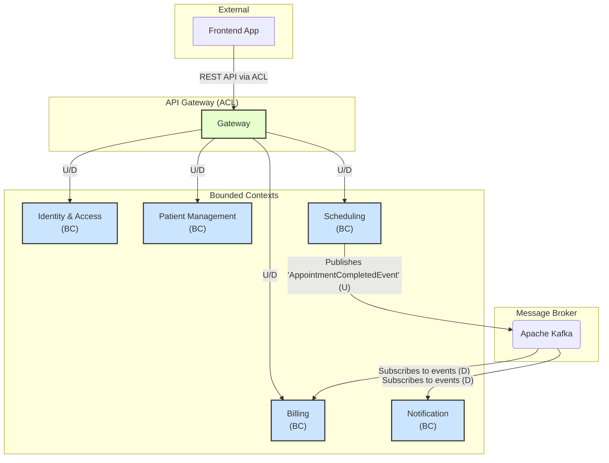
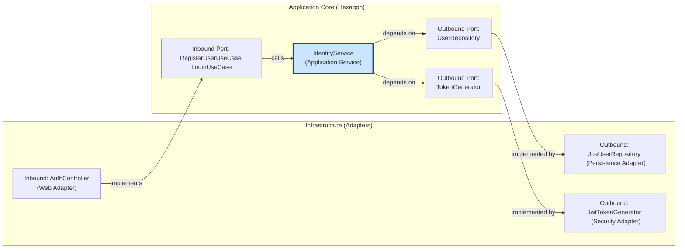
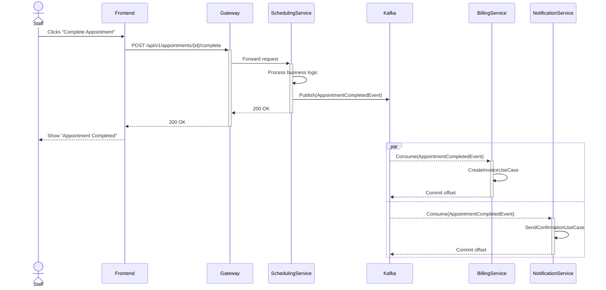

# ClinicAI - Clinic Administration System

A modern, scalable clinic administration system built with a microservices architecture. This project aims to provide a robust platform for managing patient information, scheduling, billing, and notifications within a clinical environment.

## About The Project

This system is designed following Domain-Driven Design (DDD) principles, with each microservice representing a distinct Bounded Context. The architecture is event-driven and leverages Hexagonal Architecture (Ports and Adapters) to ensure a clean separation between core business logic and external infrastructure.

### Core Technologies

*   **Backend:** Java 17, Spring Boot 3, Spring Cloud
*   **Frontend:** React, TypeScript
*   **Communication:** REST APIs & Apache Kafka for asynchronous events
*   **Database:** PostgreSQL
*   **Containerization:** Docker & Docker Compose

---

## Architectural Diagrams

The following diagrams illustrate the system's architecture from different perspectives.

<summary>1. C4 Model: System Context Diagram</summary>

This diagram shows a high-level view of the system, the key user roles, and their interactions with the ClinicAI system.



<summary>2. DDD: Bounded Context Map</summary>

This diagram models the microservices as Bounded Contexts and shows the relationships and integration patterns between them.



<summary>3. Hexagonal Architecture (Identity Service)</summary>

This diagram provides a detailed view of a single service (`identity-service`), illustrating the Hexagonal (Ports and Adapters) architecture.



<summary>4. UML Sequence Diagram: Complete Appointment Flow</summary>

This sequence diagram details the interactions between services during the "Complete Appointment" process, highlighting the asynchronous, event-driven workflow.




---

## Getting Started

Follow these instructions to get a copy of the project up and running on your local machine for development and testing purposes.

### Prerequisites

*   Java 17+
*   Maven 3.8+
*   Docker and Docker Compose
*   Node.js and npm

### Installation & Setup

1.  **Clone the repository:**
    ```sh
    git clone <your-repository-url>
    cd clinic-administration
    ```

2.  **Start infrastructure services:**
    This will start PostgreSQL databases for each service and a Kafka instance.
    ```sh
    docker-compose up -d
    ```

3.  **Build the backend microservices:**
    ```sh
    mvn clean install
    ```

4.  **Install frontend dependencies:**
    ```sh
    cd frontend-app
    npm install
    ```

## Running the Application

*   **Backend:** You can run each microservice individually from your IDE or by using the VS Code `launch.json` compound configuration "Launch All Services".
*   **Frontend:** Navigate to the `frontend-app` directory and run:
    ```sh
    npm start
    ```
    The frontend will be available at `http://localhost:3000` and will connect to the API Gateway at `http://localhost:8080`.

## API Testing

A Postman collection (`api-test-collection.json`) is included in the root of the project to test the API endpoints. Import it into Postman and set the `{{baseUrl}}` variable to `http://localhost:8080`.

# Project Structure

This document provides a high-level overview of the entire project structure, explaining the role of each top-level directory and key file.

```
.
├── .vscode/                # VS Code specific settings (e.g., launch configurations)
├── api-gateway/            # Spring Cloud Gateway for routing and cross-cutting concerns
├── billing-service/        # Microservice for handling billing and invoicing
├── identity-service/       # Microservice for user authentication and authorization
├── notification-service/   # Microservice for sending notifications (e.g., email, SMS)
├── patient-service/        # Microservice for managing patient records
├── scheduling-service/     # Microservice for managing appointments
├── frontend-app/           # Angular frontend application
├── .gitignore              # Specifies files and directories to be ignored by Git
├── docker-compose.yml      # Defines and runs multi-container Docker applications (DBs, Kafka)
├── pom.xml                 # Parent Maven Project Object Model for all backend services
├── README.md               # Main project documentation with setup and architectural diagrams
└── api-test-collection.json # Postman collection for API testing
```

## Top-Level Components

### Backend Services (`*-service/`, `api-gateway/`)

The backend is a set of Spring Boot microservices managed by a parent Maven `pom.xml`.

*   **`api-gateway`**: The single entry point for all frontend requests. It routes traffic to the appropriate downstream service and handles cross-cutting concerns like security (JWT validation) and rate limiting.
*   **`identity-service`**: Manages user registration and authentication (login). It is responsible for creating and signing JSON Web Tokens (JWTs).
*   **`patient-service`**: The Bounded Context for managing all patient-related data, such as demographics and contact information.
*   **`scheduling-service`**: Handles the creation and management of appointments. It publishes events (e.g., `AppointmentCompletedEvent`) to Kafka.
*   **`billing-service`**: Subscribes to events from Kafka to generate invoices and manage financial records.
*   **`notification-service`**: Subscribes to events from Kafka to send notifications to users (e.g., appointment confirmations).

### Frontend Applications

The project contains a Angular based frontend application.

*   **`frontend-app/`**: The primary user interface with **Angular**. It mirrors the functionality of the replaced React app, showcasing a different approach to state management and component architecture.

### Root-Level Files

*   **`pom.xml`**: The Maven parent POM. It manages shared dependencies, properties, and build configurations for all Java-based microservices, ensuring consistency.
*   **`docker-compose.yml`**: Defines the project's infrastructure dependencies (PostgreSQL databases for each service, Apache Kafka). It allows for a one-command startup of all necessary backing services.
*   **`README.md`**: The main entry point for project documentation. It contains setup instructions, an overview, and architectural diagrams.
*   **`.gitignore`**: Ensures that build artifacts, IDE configuration, and other non-essential files are not committed to source control.
*   **`api-test-collection.json`**: A ready-to-use Postman collection for easily testing all backend API endpoints through the gateway.
*   **`.vscode/launch.json`**: A configuration file for Visual Studio Code that allows you to launch and debug all microservices simultaneously with a single command.

