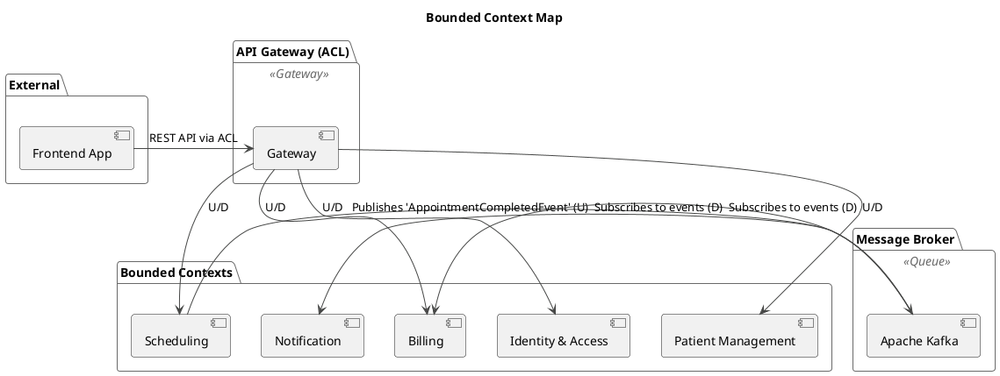
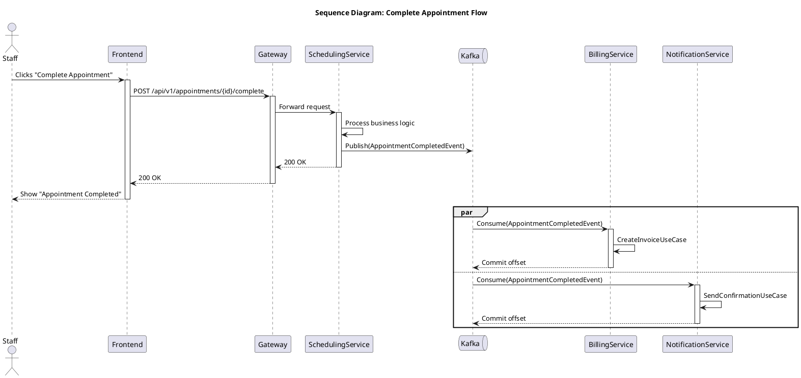

```
clinicai
├─ billing-service
│  ├─ pom.xml
│  ├─ source
│  │  └─ main
│  │     └─ java
│  │        ├─ com
│  │        │  └─ dgw
│  │        │     └─ clinicai
│  │        │        ├─ BillingApplication.java
│  │        │        └─ billing
│  │        │           ├─ application
│  │        │           │  ├─ port
│  │        │           │  │  ├─ in
│  │        │           │  │  │  ├─ CreateInvoiceCommand.java
│  │        │           │  │  │  └─ CreateInvoiceUseCase.java
│  │        │           │  │  └─ out
│  │        │           │  │     └─ InvoiceRepository.java
│  │        │           │  └─ service
│  │        │           │     └─ InvoiceService.java
│  │        │           ├─ domain
│  │        │           │  └─ model
│  │        │           │     ├─ Invoice.java
│  │        │           │     ├─ InvoiceId.java
│  │        │           │     ├─ InvoiceStatus.java
│  │        │           │     ├─ LineItem.java
│  │        │           │     └─ Money.java
│  │        │           └─ infrastructure
│  │        │              ├─ adapter
│  │        │              │  ├─ in
│  │        │              │  │  └─ messaging
│  │        │              │  │     ├─ AppointmentEventListener.java
│  │        │              │  │     ├─ SchedulingEventTranslator.java
│  │        │              │  │     └─ dto
│  │        │              │  │        └─ AppointmentCompletedEvent.java
│  │        │              │  └─ out
│  │        │              │     └─ persistence
│  │        │              │        ├─ JpaInvoiceRepository.java
│  │        │              │        ├─ SpringInvoiceRepository.java
│  │        │              │        ├─ entity
│  │        │              │        │  └─ InvoiceEntity.java
│  │        │              │        └─ mapper
│  │        │              │           └─ InvoiceMapper.java
│  │        │              └─ config
│  │        │                 └─ KafkaConsumerConfig.java
│  │        └─ resources
│  │           └─ application.yml
│  └─ target
├─ api-gateway
│  ├─ pom.xml
│  ├─ source
│  │  └─ main
│  │     └─ java
│  │        ├─ com
│  │        │  └─ dgw
│  │        │     └─ clinicai
│  │        │        ├─ GatewayApplication.java
│  │        │        └─ gateway
│  │        │           ├─ filter
│  │        │           │  ├─ MonAuthorizationFilterFactoryey.java
│  │        │           │  └─ JwtAuthenticationFilter.java
│  │        │           └─ util
│  │        │              └─ JwtUtil.java
│  │        └─ resources
│  │           └─ application.yml
│  └─ target
├─ identity-service
│  ├─ pom.xml
│  ├─ source
│  │  └─ main
│  │     └─ java
│  │        ├─ com
│  │        │  └─ dgw
│  │        │     └─ clinicai
│  │        │        ├─ IdentityApplication.java
│  │        │        └─ identity
│  │        │           ├─ application
│  │        │           │  ├─ port
│  │        │           │  │  ├─ in
│  │        │           │  │  │  ├─ LoginCommand.java
│  │        │           │  │  │  ├─ LoginResult.java
│  │        │           │  │  │  ├─ LoginUseCase.java
│  │        │           │  │  │  ├─ RegisterUserCommand.java
│  │        │           │  │  │  └─ RegisterUserUseCase.java
│  │        │           │  │  └─ out
│  │        │           │  │     ├─ TokenGenerator.java
│  │        │           │  │     └─ UserRepository.java
│  │        │           │  └─ service
│  │        │           │     └─ IdentityService.java
│  │        │           ├─ domain
│  │        │           │  └─ model
│  │        │           │     ├─ Role.java
│  │        │           │     ├─ User.java
│  │        │           │     └─ UserId.java
│  │        │           └─ infrastructure
│  │        │              ├─ adapter
│  │        │              │  ├─ in
│  │        │              │  │  └─ messaging
│  │        │              │  │     └─ web
│  │        │              │  │        └─ AuthController.java
│  │        │              │  └─ out
│  │        │              │     ├─ persistence
│  │        │              │     |  ├─ mapper
│  │        │              │     |  |  ├─ UserMapper.java
│  │        │              │     |  |  └─ entity
│  │        │              │     |  │     └─ UserEntity.java
│  │        │              │     |  ├─ JpaInvoiceRepository.java
│  │        │              │     |  └─ SpringInvoiceRepository.java
│  │        │              │     └─ seccurity
│  │        │              │        └─ JwtTokenGenerator.java
│  │        │              └─ config
│  │        │                 └─ SecurityConfig.java
│  │        └─ resources
│  │           └─ application.yml
│  └─ target
├─ notification-service
│  ├─ pom.xml
│  ├─ source
│  │  └─ main
│  │     └─ java
│  │        ├─ com
│  │        │  └─ dgw
│  │        │     └─ clinicai
│  │        │        ├─ NotificationApplication.java
│  │        │        └─ notification
│  │        │           ├─ application
│  │        │           │  ├─ port
│  │        │           │  │  ├─ in
│  │        │           │  │  │  └─ SendNotificationUseCase.java
│  │        │           │  │  └─ out
│  │        │           │  │     └─ NotificationSender.java
│  │        │           │  └─ service
│  │        │           │     └─ NotificationService.java
│  │        │           ├─ domain
│  │        │           │  └─ model
│  │        │           │     ├─ Notification.java
│  │        │           │     └─ NotificationRequest.java
│  │        │           └─ infrastructure
│  │        │              ├─ adapter
│  │        │              │  ├─ in
│  │        │              │  │  └─ messaging
│  │        │              │  │     ├─ BillingEventListener.java
│  │        │              │  │     └─ dto
│  │        │              │  │        └─ InvoiceIssuedEvent.java
│  │        │              │  └─ out
│  │        │              │     └─ email
│  │        │              │        ├─ LoggingNotificationSender.java
│  │        │              │        └─ SmtpNotificationSender.java
│  │        │              └─ config
│  │        │                 └─ KafkaConsumerConfig.java
│  │        └─ resources
│  │           └─ application.yml
│  └─ target
├─ docker-compose.yml
├─ init-multiple-databases.sh
├─ launch.json
├─ patient-service
│  ├─ pom.xml
│  ├─ src
│  │  └─ main
│  │     ├─ java
│  │     │  └─ com
│  │     │     └─ dgw
│  │     │        └─ clinicai
│  │     │           └─ patient
│  │     │              ├─ PatientApplication.java
│  │     │              ├─ application
│  │     │              │  ├─ port
│  │     │              │  │  ├─ in
│  │     │              │  │  │  ├─ RegisterNewPatientUseCase.java
│  │     │              │  │  │  └─ RegisterPatientCommand.java
│  │     │              │  │  └─ out
│  │     │              │  │     └─ PatientRepository.java
│  │     │              │  └─ service
│  │     │              │     └─ PatientService.java
│  │     │              ├─ domain
│  │     │              │  └─ model
│  │     │              │     ├─ Address.java
│  │     │              │     ├─ ContactInfo.java
│  │     │              │     ├─ Patient.java
│  │     │              │     └─ PatientId.java
│  │     │              └─ infrastructure
│  │     │                 └─ adapter
│  │     │                    ├─ in
│  │     │                    │  └─ web
│  │     │                    │     └─ PatientController.java
│  │     │                    └─ out
│  │     │                       └─ persistence
│  │     │                          ├─ JpaPatientRepository.java
│  │     │                          ├─ SpringPatientRepository.java
│  │     │                          ├─ entity
│  │     │                          │  ├─ AddressEmbeddable.java
│  │     │                          │  ├─ ContactInfoEmbeddable.java
│  │     │                          │  └─ PatientEntity.java
│  │     │                          └─ mapper
│  │     │                             └─ PatientMapper.java
│  │     └─ resources
│  │        └─ application.yml
│  └─ target
├─ pom.xml
├─ scheduling-service
│  ├─ pom.xml
│  ├─ source
│  │  └─ main
│  │     └─ java
│  │        ├─ com
│  │        │  └─ dgw
│  │        │     └─ clinicai
│  │        │        └─ scheduling
│  │        |           ├─ SchedulingApplication.java
│  │        |           ├─ application
│  │        |           │  ├─ port
│  │        |           │  │  ├─ in
│  │        |           │  │  │  ├─ CompleteAppointmentUseCase.java
│  │        |           │  │  └─ out
│  │        |           │  │     ├─ AppointmentRepository.java
│  │        |           │  │     └─ EventPublisher.java
│  │        |           │  └─ service
│  │        |           │     └─ AppointmentService.java
│  │        |           ├─ domain
│  │        |           │  └─ model
│  │        |           │     ├─ events
│  │        |           │     |  ├─ Appointment.java
│  │        |           │     |  ├─ AppointmentCompletedEvent.java
│  │        |           │     |  └─ DomainEvent.java
│  │        |           │     ├─ AppointmentId.java
│  │        |           │     └─ AppointmentStatus.java
│  │        |           └─ infrastructure
│  │        |              └─ adapter
│  │        |                 ├─ in
│  │        |                 │  └─ web
│  │        |                 │     ├─ AppointmentController.java
│  │        |                 │     └─ CompleteAppointmentCommand.java
│  │        |                 └─ out
│  │        |                    ├─ persistence
│  │        |                    |  ├─ JpaPatientRepository.java
│  │        |                    |  ├─ SpringPatientRepository.java
│  │        |                    |  ├─ entity
│  │        │                    |  │  └─ AppointmentEntity.java
│  │        |                    |  └─ mapper
│  │        │                    |     └─ AppointmentMapper.java
│  │        |                    └─ messaging
│  │        |                       └─ KafkaEventPublisher.java
│  │        └─ resources
│  │           └─ application.yml
│  └─ target
└─ frontend-service
   ├─ tsconfig.json
   ├─ package.json
   ├─ public
   │  └─ index.html
   └─ src
      ├─ App.tsx
      ├─ index.css
      ├─ index.tsx
      ├─ api
      |  └─ api.ts
      ├─ components
      |  ├─ DashboardPage.tsx
      |  ├─ LoginPage.tsx
      |  ├─ PatientRegistrationPage.tsx
      |  └─ PrivateRoute.tsx
      └─ context
         └─ AuthContext.tsx

# ClinicAI - Clinic Administration System

A modern, scalable clinic administration system built with a microservices architecture. This project aims to provide a robust platform for managing patient information, scheduling, billing, and notifications within a clinical environment.

## About The Project

This system is designed following Domain-Driven Design (DDD) principles, with each microservice representing a distinct Bounded Context. The architecture is event-driven and leverages Hexagonal Architecture (Ports and Adapters) to ensure a clean separation between core business logic and external infrastructure.

### Core Technologies

*   **Backend:** Java 17, Spring Boot 3, Spring Cloud
*   **Frontend:** React, TypeScript
*   **Communication:** REST APIs & Apache Kafka for asynchronous events
*   **Database:** PostgreSQL
*   **Containerization:** Docker & Docker Compose

---

## Architectural Diagrams

The following diagrams illustrate the system's architecture from different perspectives.

<details>
<summary>1. C4 Model: System Context Diagram</summary>

This diagram shows a high-level view of the system, the key user roles, and their interactions with the ClinicAI system.

```plantuml
@startuml
!include https://raw.githubusercontent.com/plantuml-stdlib/C4-PlantUML/master/C4_Context.puml

title System Context Diagram for ClinicAI

Person(admin, "Clinic Administrator", "Manages users, patients, and system settings.")
Person(staff, "Clinic Staff", "Manages appointments, billing, and patient interactions.")

System(clinicAiSystem, "ClinicAI System", "The complete clinic administration software suite, including all microservices and the frontend.")

Rel(admin, clinicAiSystem, "Uses the system to perform administrative tasks")
Rel(staff, clinicAiSystem, "Uses the system to manage daily clinic operations")

@enduml
```

</details>

<details>
<summary>2. DDD: Bounded Context Map</summary>

This diagram models the microservices as Bounded Contexts and shows the relationships and integration patterns between them.



</details>

<details>
<summary>3. Hexagonal Architecture (Identity Service)</summary>

This diagram provides a detailed view of a single service (`identity-service`), illustrating the Hexagonal (Ports and Adapters) architecture.

```plantuml
@startuml
title Hexagonal Architecture (Identity Service)

!theme vibrant

package "Application Core (Hexagon)" {
    [IdentityService] as Core
    
    interface "RegisterUserUseCase, LoginUseCase" as InboundPort
    interface "UserRepository" as OutboundPortRepo
    interface "TokenGenerator" as OutboundPortToken
}

package "Infrastructure (Adapters)" {
    [AuthController] as WebAdapter
    [JpaUserRepository] as PersistenceAdapter
    [JwtTokenGenerator] as SecurityAdapter
}

WebAdapter -up-|> InboundPort : implements
InboundPort -right-( Core : calls

Core .down.> OutboundPortRepo : depends on
Core .down.> OutboundPortToken : depends on

PersistenceAdapter .up.|- OutboundPortRepo : implements
SecurityAdapter .up.|- OutboundPortToken : implements

@enduml
```

</details>

<details>
<summary>4. UML Sequence Diagram: Complete Appointment Flow</summary>

This sequence diagram details the interactions between services during the "Complete Appointment" process, highlighting the asynchronous, event-driven workflow.



</details>

---

## Getting Started

Follow these instructions to get a copy of the project up and running on your local machine for development and testing purposes.

### Prerequisites

*   Java 17+
*   Maven 3.8+
*   Docker and Docker Compose
*   Node.js and npm

### Installation & Setup

1.  **Clone the repository:**
    ```sh
    git clone <your-repository-url>
    cd clinic-administration
    ```

2.  **Start infrastructure services:**
    This will start PostgreSQL databases for each service and a Kafka instance.
    ```sh
    docker-compose up -d
    ```

3.  **Build the backend microservices:**
    ```sh
    mvn clean install
    ```

4.  **Install frontend dependencies:**
    ```sh
    cd frontend-app
    npm install
    ```

## Running the Application

*   **Backend:** You can run each microservice individually from your IDE or by using the VS Code `launch.json` compound configuration "Launch All Services".
*   **Frontend:** Navigate to the `frontend-app` directory and run:
    ```sh
    npm start
    ```
    The frontend will be available at `http://localhost:3000` and will connect to the API Gateway at `http://localhost:8080`.

## API Testing

A Postman collection (`api-test-collection.json`) is included in the root of the project to test the API endpoints. Import it into Postman and set the `{{baseUrl}}` variable to `http://localhost:8080`.


```
